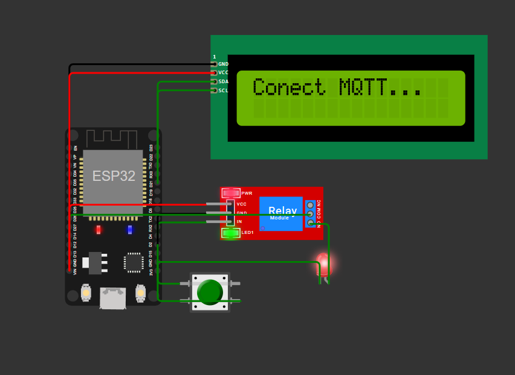

# 💧 Sistema de Monitoramento de Consumo de Água com Limite Diário (ONU) 

[](https://wokwi.com)
[](https://opensource.org/licenses/MIT)
[](https://mqtt.org/)

 *(adicione uma imagem real depois)*

Projeto IoT que simula um sistema inteligente de controle de consumo de água baseado no limite da ONU (**110L/pessoa/dia**). Desenvolvido com **ESP32**, **LCD I2C** e comunicação **MQTT** via HiveMQ para monitoramento remoto.

## 🌟 Recursos Principais

| Funcionalidade               | Descrição                                                                 |
|------------------------------|---------------------------------------------------------------------------|
| 📊 **Monitoramento em Tempo Real** | Medição contínua do consumo de água (simulado)                           |
| ⚠️ **Limite Automático**       | Fecha a válvula ao atingir 110L/dia                                      |
| 🎛 **Bônus por Botão**         | +20L extras por acionamento físico                                       |
| 📺 **Display LCD**            | Mostra consumo atual e status do sistema                                 |
| 🌐 **Integração MQTT**        | Envio de dados para HiveMQ em tempo real                                 |

## 🛠 Componentes Utilizados
- **Microcontrolador**: ESP32 DevKit V1
- **Display**: LCD 16x2 (I2C)
- **Atuadores**: 
  - Módulo Relé (simula válvula solenoide)
  - LED (status da válvula)
- **Entrada**: Pushbutton para liberação de bônus
- **Cloud**: Broker HiveMQ

## ⚙️ Configuração MQTT
```yaml
Broker: broker.hivemq.com
Porta: 1883
Tópico: agua/consumo
Payload Exemplo: 
{
  "litros": 135.50,
  "valvula_aberta": false
} 
```

## 🖥 Interface no LCD
```yaml
-----------------
| Consumo: 87.5L |
| Fluxo: 10.0L/s |
-----------------
```

Estados Especiais:

Limite atingido! Liberações: 2

Uso liberado! Liberação #3

🚀 Como Executar
Simulação no Wokwi:
git clone seu-repositorio https://github.com/allanpradella/projetoMCA
abra no Wokwi

### Conexões:

LCD → ESP32 (SDA:D21, SCL:D22)

Botão → Pino 4

LED → Pino 2

### Monitoramento:

Acesse HiveMQ Web Client [ https://console.hivemq.cloud/ ]
Inscreva-se no tópico agua/consumo ou em todos 

## 📊 Dashboard 


## 🎥 Demonstração
https://youtu.be/_3sNX8N_Xhc